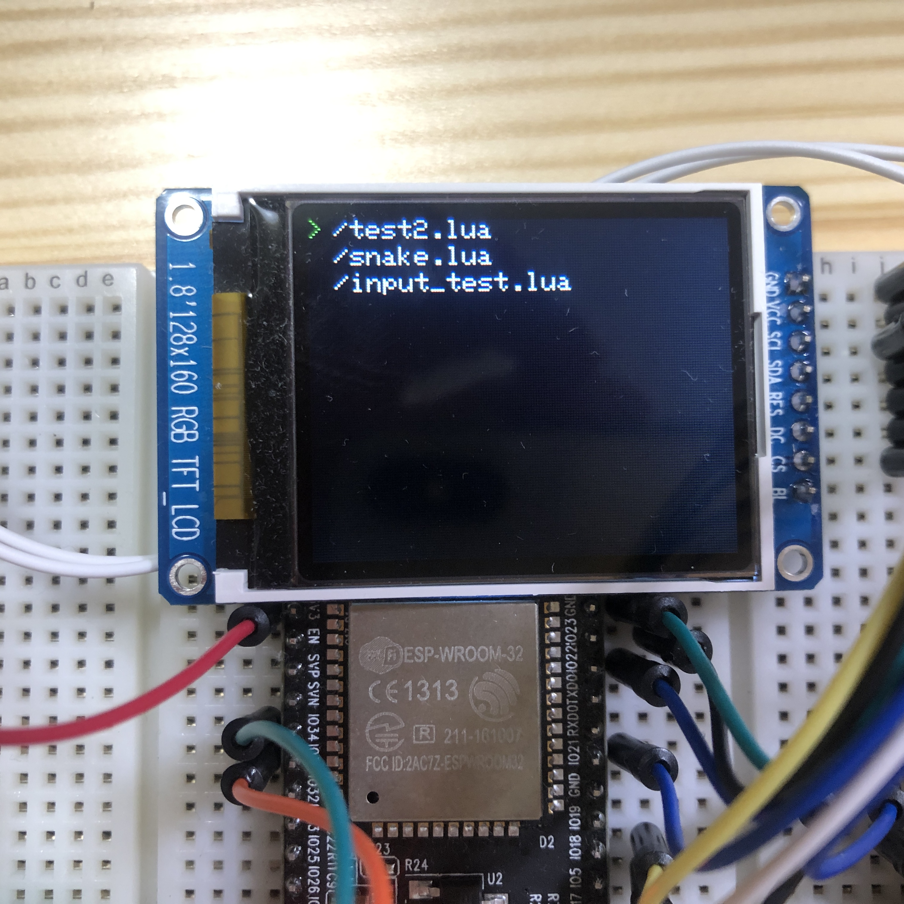
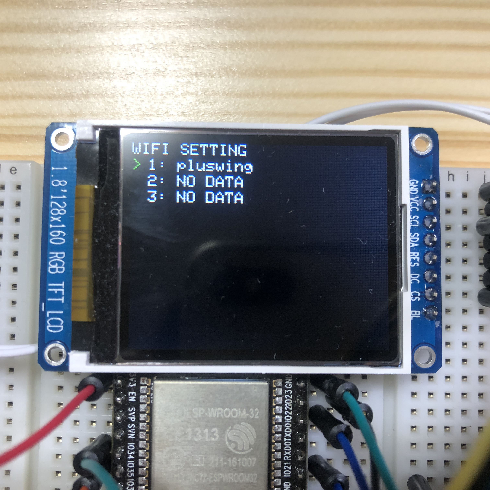

# ESP Console
DIY Game Console with ESP32  
紹介動画: https://youtu.be/rkK88xarytI

## これはなに？
Lua言語で簡単にゲームプログラミングができ、
WEB APIで作ったゲームを実機に転送、実行が可能なゲーム機のファームウェアです。

ゲーム機自体も、電子部品をブレッドボード上で接続するだけなので、簡単に作ることができます。

## 必要な電子部品
- ESP32-DevKitC
  - http://akizukidenshi.com/catalog/g/gM-11819/
- ブレッドボード(2つ必要です。)
  - http://akizukidenshi.com/catalog/g/gP-05294/
- ジャンパーワイヤー
  - http://akizukidenshi.com/catalog/g/gC-05159/
- タクトスイッチ
  - http://akizukidenshi.com/catalog/g/gP-02561/
- カラー液晶 ST7735
  - https://amzn.to/2McLzbK
- アナログジョイスティック
  - http://akizukidenshi.com/catalog/g/gK-10263/

### 部品と回路図の解説動画はこちら
https://youtu.be/0KpF7hCuopo

## 回路図


## ブレッドボード配線例


## ファームウェア書き込み

書き込み手順の動画はこちら  
https://youtu.be/W4PruBg9Ut0  


1. Arduino IDEのインストール  
こちらよりダウンロードし、インストールします。  
https://www.arduino.cc/en/main/software

2. arduino-esp32 の設定  
こちらの手順にしたがってArduino IDEにarduino-esp32をインストールします。  
https://github.com/espressif/arduino-esp32/blob/master/docs/arduino-ide/boards_manager.md

3. このリポジトリをダウンロード  
「Clone or Download」ボタンをクリックし、「Download ZIP」をクリックすると、ダウンロードできます。

4. Dependency Arduino librariesのインストール  
次章に記載のある「Dependency Arduino libraries」のライブラリをインストールします。  
ESPAsyncWebServer, AsyncTCP はリンクから3の手順と同じく、ZIPファイルをダウンロード。  
解凍したファイルをlibrariesフォルダにコピーしてください。  
そのほかは、Arduino IDEのメニューから、[スケッチ]->[ライブラリをインクルード]->[ライブラリを管理...]からライブラリ名で探してインストールしてください。

5. ファームウェア書き込み  
ESP32-DevKitCとPCをUSBケーブルで接続し、  
3でダウンロードしたファイルを解凍し、espconsole.inoをArduino IDEで開きます。  
Arduino IDEのメニューから、[ツール]->[ボード]から「ESP32 Dev Module」を洗濯します。  
[ツール]->[ボード]の下にUpload Speedなどが表示されるので、  
以下に従い設定を変更します。

- Upload Speed: 921600
- CPU Frequency: 240MHz (WiFi/BT)
- Flash Frequency: 80MHz
- Flash Mode: QUI
- Flash Size: 4MB (32Mb)
- Partition Scheme: Default 4MB with spiffs (1.2MB APP/1.5MB SPIFFS)
- Core Debug Level: なし
- PSRAM: Disabled

  [ツール]->[ボード]->[シリアルポート]から「...USBtoUART」という名前のものを探し選択します。  
これは、ESP32-DevKitCをUSBケーブルで接続してないと表示されないので注意してください。  

  「マイコンボードに書き込む」（アイコンが右矢印）ボタンを押して、ファームウェアを書き込みます。  
  書き込みに成功すれば、液晶にWIFI接続設定画面が表示されます。

## Dependency Arduino libraries
- Adafruit_GFX (1.5.6)
  - https://github.com/adafruit/Adafruit-GFX-Library
- Adafruit_ST7735 (1.3.7)
  - https://github.com/adafruit/Adafruit-ST7735-Library
- ESPAsyncWebServer (commit: b0c6144886f4e1f88684f708d7b2974143d8601c)
  - https://github.com/me-no-dev/ESPAsyncWebServer
- AsyncTCP (commit: 90715ae6b3ee72e9e40cd3dd2f9609217bf3ee02)
  - https://github.com/me-no-dev/AsyncTCP
- ArduinoJson (6.11.1)
  - https://github.com/bblanchon/ArduinoJson

## 操作方法

操作方法についての動画はこちら  
https://youtu.be/Zx4Hu4sScks


### SSID選択画面

ファームウェア書き込み直後は、この画面が表示されます。  
接続するSSIDを選択します。

- 上: カーソル移動
- 下: カーソル移動
- B: WIFI接続をキャンセルし、ゲーム選択画面へ
- A: 決定し、パスワード入力画面へ


### パスワード入力画面
選択したSSIDのパスワードを入力します。  
入力したパスワードが間違えている場合、再度SSID選択画面へ遷移します。

- 上: 文字変更
- 下: 文字変更
- 右: 
  - 入力時: 大文字、小文字変換。記号選択時は'A'に戻る
  - [OK]選択時: 入力へ戻る
- 左: [OK]へ移動
- A:
  - 入力時: 文字確定
  - [OK]選択時: 保存
- B: 1文字削除


### ゲーム選択画面
ゲームは初回起動時は何も入っていません。  
WEB APIでゲームファイルをアップロードしてください。

- 上: カーソル移動
- 下: カーソル移動
- 右: WIFI設定画面へ
- A: ゲーム開始



### WIFI設定画面
保存済みのWIFI設定の確認・変更・削除を行います。

- 上: カーソル移動
- 下: カーソル移動
- 左: ゲーム選択画面へ
- A: パスワード再入力
- B: SSID削除画面へ



### SSID削除画面
SSIDを削除します。

- A: 削除
- B: 削除キャンセル


## ゲームAPI

開発言語であるLuaとゲームAPIの解説・紹介動画はこちら  
https://youtu.be/7wDIN2hJ3MU

サンプルゲームのライブコーディングはこちら  
https://youtu.be/lSGPfCBZl14


### ENV
- width()  
  画面の幅を取得します。
- height()  
  画面の高さを取得します。
- setFPS(fps)  
  FPSを設定します。
- getFPS()  
  設定されているFPSを取得します。
- showFPS(x, y, color)  
  [デバッグ用] FPSを画面に描画します。
- print(s)
  [デバッグ用] 文字列`s`をシリアルコンソールに出力します。

### INPUT
- btn(button)  
  指定のボタンが押されている場合、`true`を返します。
- btnp(button)  
  そのフレーム中に指定のボタンが押された時に`true`を返します。
- btnr(button)  
  そのフレーム中に指定のボランが話された時に`true`を返します。
- analogX()  
  アナログスティックの横方向の入力値を`-100`~`100`の値で取得します。
- analogY()  
  アナログスティックの縦方向の入力値を`-100`~`100`の値で取得します。

### buttons
- BTN_A
- BTN_B
- BNT_UP
- BTN_DOWN
- BTN_LEFT
- BTN_RIGHT

### Graphics
- cls(color)  
  画面を指定色で塗りつぶします。
- pix(x, y, color)  
  `color`色で`x`, `y`にドットを描画します。
- line(x1, y1, x2, y2, color)  
  `color`色で`(x1,y1)`, `(x2, y2)`間に線を描画します。
- rect(x, y, w, h, color)  
  `color`色で`(x,y)`を起点に幅`w`,高さ`h`の矩形（塗りつぶし）を描画します。
- rectb(x, y, w, h, color)  
  `color`色で`(x,y)`を起点に幅`w`,高さ`h`の矩形（輪郭線のみ）を描画します。
- circ(x, y, r, color)  
  `color`色で`(x,y)`を起点に半径`r`の円（塗りつぶし）を描画します。
- circb(x, y, r, color)  
  `color`色で`(x,y)`を起点に半径`r`の円（輪郭線のみ）を描画します。
- text(x, y, s, color)  
  `color`色で文字列`s`を`(x, y)`座標を起点に描画します。
- color(r, g, b)  
  色を作成します。`r,g,b`それぞれ0-255の間で指定してください。

### colors
- COLOR_WHITE
- COLOR_BLACK
- COLOR_RED
- COLOR_GREEN
- COLOR_BLUE
- COLOR_MAGENTA
- COLOR_CYAN
- COLOR_YELLOW

色指定は、BGR565です。`color()`メソッドで色を作成することができます。

## Web API

## upload file
```
curl -X POST http://espconsole.local/upload -F "file=@input_test.lua"
```

## delete file
```
curl -X POST http://espconsole.local/delete -F "file=/test3.lua"
```

## list files
```
curl -X POST http://espconsole.local/list
```

# License
MIT
